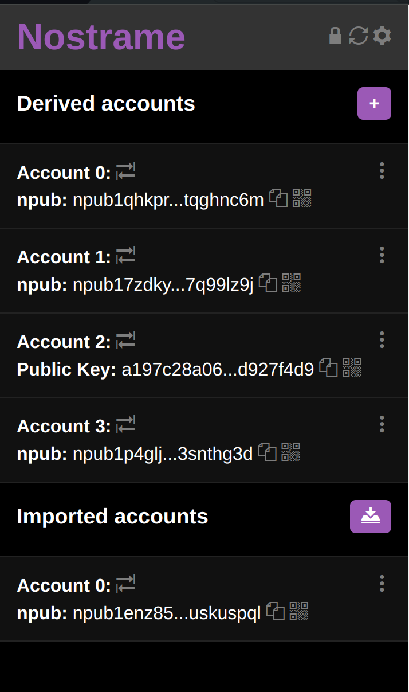
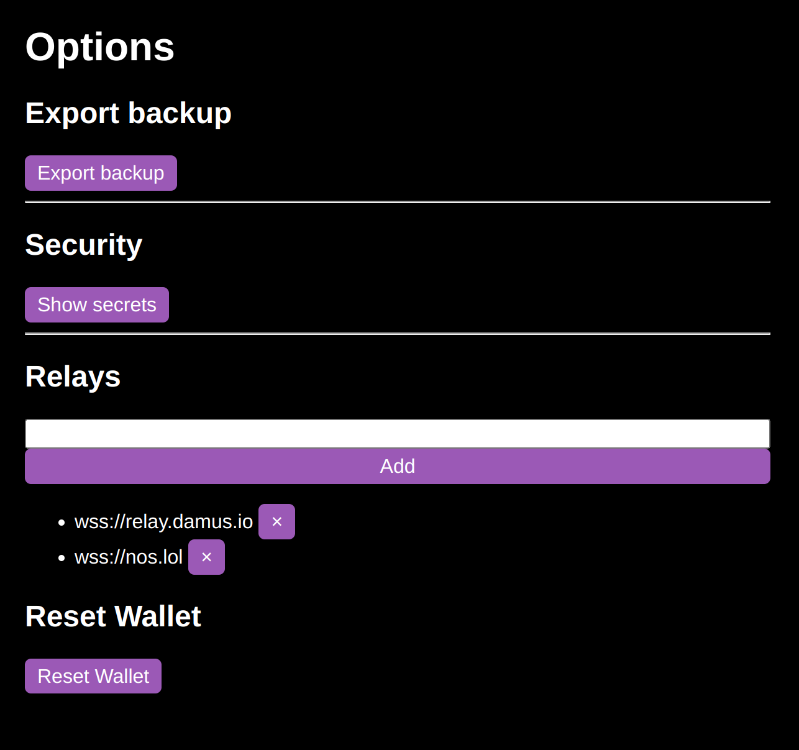

# Nostrame(Nostr Account Manager Extension)

Nostrame is a comprehensive account management solution designed to streamline your digital accounts handling. With its robust features, you can effortlessly generate accounts using a mnemonic and passphrase, import external accounts in hex and bech32 formats, and conveniently access and modify kind 0 data. What sets Nostrame apart is its advanced encryption capabilities, allowing you to safeguard your mnemonic with ease. Additionally, it have backup encrypted processes by enabling import and export functionalities using a master password.






This extension is Chromium-only.

## Develop

To run the plugin from this code:

```
git clone https://github.com/Anderson-Juhasc/nostrame
cd nostrame
npm i
npm run build
```

then

1. go to `chrome://extensions`;
2. ensure "developer mode" is enabled on the top right;
3. click on "Load unpackaged";
4. select the `extension/` folder of this repository.

---

LICENSE: public domain.
