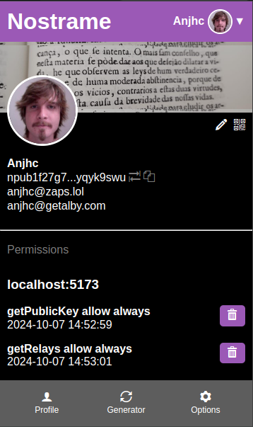

# Nostrame - Nostr Signer & Account Management Extension

A browser extension for Chromium that implements [NIP-07](https://github.com/nostr-protocol/nips/blob/master/07.md), allowing you to sign Nostr events on web applications without exposing your private keys.

[](https://chromewebstore.google.com/detail/nostrame/phfdiknibomfgpefcicfckkklimoniej)
[](LICENSE)



## Features

### NIP-07 Signer
- `getPublicKey()` - Share your public key with applications
- `signEvent(event)` - Sign events without exposing private keys
- `nip04.encrypt/decrypt()` - Encrypted direct messages
- `nip44.encrypt/decrypt()` - Versioned encryption

### Account Management
- Derive multiple accounts from a single mnemonic seed phrase (BIP-39)
- Generate new accounts with random mnemonic
- Import existing accounts via nsec, hex, or ncryptsec (NIP-49)
- Switch between accounts

### Relay Management
- Configure read/write relay lists (NIP-65)
- Outbox model support for profile fetching

### Security
- Master password encryption (AES-256-GCM, PBKDF2 with 600k iterations)
- Private keys stored only in service worker memory (never in storage)
- Auto-lock after configurable inactivity timeout
- Per-website permission management
- Private keys never exposed to websites

### Backup & Recovery
- Export encrypted vault backup
- Import backup with password
- Mnemonic seed phrase recovery

## Supported NIPs

| NIP | Description | Status |
|-----|-------------|--------|
| [NIP-01](https://github.com/nostr-protocol/nips/blob/master/01.md) | Basic Protocol | ✅ Event signing |
| [NIP-04](https://github.com/nostr-protocol/nips/blob/master/04.md) | Encrypted Direct Messages | ✅ |
| [NIP-06](https://github.com/nostr-protocol/nips/blob/master/06.md) | Key Derivation from Mnemonic | ✅ |
| [NIP-07](https://github.com/nostr-protocol/nips/blob/master/07.md) | Browser Signer | ✅ |
| [NIP-19](https://github.com/nostr-protocol/nips/blob/master/19.md) | bech32-encoded Entities | ✅ npub, nsec, nprofile, nevent |
| [NIP-44](https://github.com/nostr-protocol/nips/blob/master/44.md) | Versioned Encryption | ✅ |
| [NIP-49](https://github.com/nostr-protocol/nips/blob/master/49.md) | Private Key Encryption | ✅ ncryptsec import/export |
| [NIP-65](https://github.com/nostr-protocol/nips/blob/master/65.md) | Relay List Metadata | ✅ Read/write relay configuration |

## Install

### Chrome Web Store

[](https://chromewebstore.google.com/detail/nostrame/phfdiknibomfgpefcicfckkklimoniej)

### Manual Installation

Download the latest release from [GitHub Releases](https://github.com/Anderson-Juhasc/nostrame/releases) and load it as an unpacked extension.

## Development

```bash
# Clone the repository
git clone https://github.com/Anderson-Juhasc/nostrame
cd nostrame

# Install dependencies
npm install

# Build the extension
npm run build

# Watch for changes (development)
npm run watch
```

### Load in Chrome

1. Navigate to `chrome://extensions`
2. Enable **Developer mode** (top right)
3. Click **Load unpacked**
4. Select the `dist/` folder

## How It Works

1. **Create or Import** - Set up your vault with a mnemonic or import existing keys
2. **Connect** - Visit any Nostr application that supports NIP-07
3. **Approve** - Nostrame prompts you to approve signing requests
4. **Sign** - Events are signed in the extension, only the signature is shared

Your private keys never leave the extension.

## Contributing

Contributions are welcome. Please feel free to submit a Pull Request.

## Acknowledgments

Nostrame is based on [nos2x](https://github.com/fiatjaf/nos2x) by [@fiatjaf](https://github.com/fiatjaf), the original NIP-07 browser extension for Nostr.

## Related Projects

- [nos2x](https://github.com/fiatjaf/nos2x) - The original NIP-07 browser extension
- [nostr-tools](https://github.com/nbd-wtf/nostr-tools) - Nostr JavaScript library
- [NIP-07 Specification](https://github.com/nostr-protocol/nips/blob/master/07.md) - Browser extension protocol

---

**Keywords:** Nostr, Nostr signer, NIP-07, browser extension, key management, Nostr extension, event signing, Nostr account manager, Chrome extension, Chromium extension
